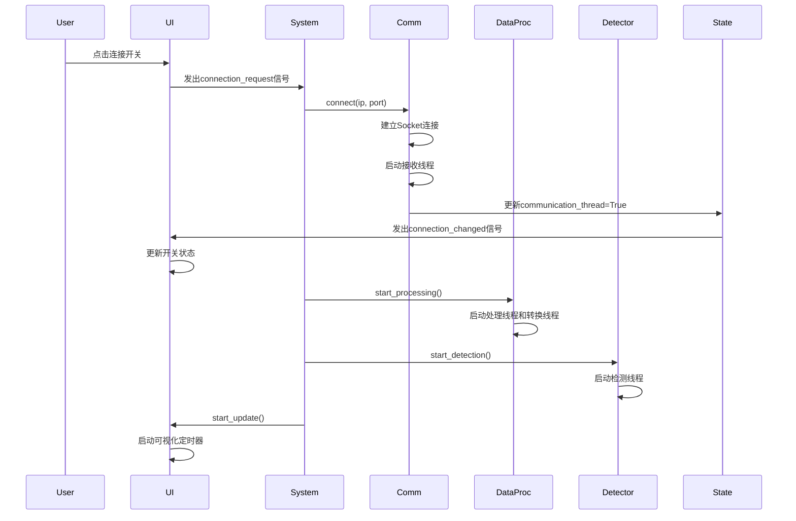

# 无人机检测系统 - 系统架构设计文档

## 1. 系统概述

无人机检测系统是一个基于射频频谱分析和深度学习的实时无人机检测平台，通过接收射频信号的FFT数据，进行实时处理、YOLO目标检测和可视化展示。系统采用四层架构设计，实现了从数据采集、信号处理、智能检测到界面展示的完整流程。

### 1.1 设计目标

- **实时性**：支持高频率的FFT数据流处理（~100fps）和实时YOLO检测
- **智能化**：集成YOLOv8深度学习模型进行无人机信号自动识别
- **可扩展性**：模块化设计，便于添加新的算法和功能
- **稳定性**：完善的错误处理和状态管理机制，多线程异步架构
- **用户友好**：现代化的UI界面，直观的数据可视化和检测结果展示

### 1.2 技术栈

| 层次 | 技术 | 说明 |
|------|------|------|
| 通信层 | Python Socket | TCP通信，接收下位机FFT数据 |
| 数据处理层 | NumPy, Threading, Matplotlib | 多线程批量处理，全局归一化，RGB图像生成 |
| 算法层 | YOLOv8, Ultralytics, OpenCV | 深度学习目标检测，结果可视化 |
| UI层 | PyQt6, QFluentWidgets | 现代化UI框架，实时显示 |
| 图表渲染 | QtCharts, QImage | 频谱图和检测结果渲染 |

---

## 2. 系统架构

### 2.1 整体架构图

```
┌─────────────────────────────────────────────────────────────┐
│                     DroneDetectionSystem                     │
│                      (系统主控制器)                          │
└────────────┬────────────────────────────────┬────────────────┘
             │                                │
             ▼                                ▼
    ┌────────────────┐                ┌──────────────┐
    │     State      │◄───────────────┤  Main Window │
    │  (状态管理器)   │                │  (主界面)     │
    └────────┬───────┘                └──────┬───────┘
             │                                │
             │ 状态共享                       │ UI更新
             │                                │
    ┌────────┴────────────┬──────────────────┴────────┬─────────┐
    │                     │                            │         │
    ▼                     ▼                            ▼         ▼
┌──────────────┐  ┌──────────────┐         ┌──────────────┐ ┌─────────────┐
│Communication │  │DataProcessor │         │DroneDetector │ │UI Interfaces│
│  (通信层)     │  │ (数据处理层) │         │  (算法层)     │ │  (界面层)    │
└──────┬───────┘  └──────┬───────┘         └──────┬───────┘ └─────────────┘
       │                  │                        │
       │ FFT Queue        │ RGB Image              │ Detection Image
       └──────────────────┴────────────────────────┘
```

### 2.2 四层架构设计

#### 2.2.1 通信层（Communication Layer）

**职责**：
- 管理与下位机的TCP连接
- 接收和解析FFT数据包
- 实现包同步和丢包检测机制
- 将完整的FFT帧放入队列

**核心机制**：
- **魔数同步**：每个数据包前添加魔数（0xAABBCCDD）用于包边界识别
- **帧重组**：通过packet_id识别帧边界，将多个包重组为完整帧
- **丢包检测**：检测packet_id的连续性，发现丢包并记录日志

**数据流向**：
```
下位机 → Socket → 魔数同步 → 包解析 → 帧重组 → FFT Queue
```

#### 2.2.2 数据处理层（Data Processing Layer）

**职责**：
- 从队列批量获取原始FFT数据
- 执行数据处理（全局归一化、批量处理）
- 维护正方形瀑布图buffer（1024×1024）
- 生成RGB图像供算法层使用
- 提供线程安全的数据访问接口

**核心功能**：
1. **批量处理**：
   - 批量获取队列中所有数据
   - 全局归一化到[0, 1]范围
   - 提高处理效率

2. **双线程设计**：
   - **处理线程**：更新瀑布图buffer
   - **转换线程**：将buffer转换为RGB图像（独立线程，避免阻塞）

3. **正方形瀑布图**：
   - 尺寸：FFT长度 × FFT长度（默认1024×1024）
   - 格式：RGB图像（uint8，0-255）
   - 色图：Jet色图映射

4. **线程安全**：
   - 使用`data_lock`保护buffer数据
   - 使用`image_lock`保护RGB图像
   - 所有get方法返回数据副本

**数据流向**：
```
FFT Queue → 批量获取 → 全局归一化 → 瀑布图buffer → RGB转换线程 → RGB图像
```

#### 2.2.3 算法层（Algorithm Layer）

**职责**：
- 从数据处理层获取RGB瀑布图
- 使用YOLO模型进行目标检测
- 在图像上绘制检测框和标签
- 维护带检测结果的图像供UI显示
- 提供检测统计信息

**核心功能**：
1. **YOLO检测**：
   - 输入：1024×1024×3 RGB图像
   - 输出：检测框坐标、置信度、类别
   - 参数：置信度阈值、NMS IoU阈值

2. **结果可视化**：
   - 在原图上绘制绿色检测框
   - 添加类别标签和置信度
   - 黑底绿框文字背景

3. **独立检测线程**：
   - 实时读取最新RGB图像
   - 异步检测不阻塞数据采集
   - 检测完成后立即更新结果

4. **线程安全**：
   - 使用`detection_lock`保护检测结果
   - 提供线程安全的图像和统计信息访问

**数据流向**：
```
RGB图像 → YOLO检测 → 绘制检测框 → 更新结果图像 → UI显示
```

#### 2.2.4 用户界面层（UI Layer）

**职责**：
- 从算法层获取带检测框的图像
- 降采样后显示（提高渲染性能）
- 实时显示频谱数据
- 参数配置界面
- 系统状态监控
- 用户交互处理

**界面组成**：
- **Home Interface**：主界面，包含实时频谱图、检测结果显示和配置面板
- **Config Interface**：详细参数配置
- **Visualization Interface**：专用可视化分析界面

**显示策略**：
- UI从算法层获取的图像已带检测框
- 降采样提高显示性能
- 保证显示的图像和检测框完全同步

---

## 3. 核心模块详解

### 3.1 状态管理（State）

State类是系统的核心状态管理器，继承自QObject支持信号机制。

**属性**：
```python
_communication_thread: bool     # 通信线程运行状态
data_processing_thread: bool    # 数据处理线程运行状态
detection_thread: bool          # 检测线程运行状态（新增）
data_queue_status: str          # 队列状态（idle/processing/error）
device_ip: str                  # 设备IP地址
device_port: int                # 设备端口
fft_length: int                 # FFT长度
center_freq: float              # 中心频率（MHz）
sample_rate: float              # 采样率（MHz）
```

**信号**：
```python
connection_changed = pyqtSignal(bool)  # 连接状态变化信号
```

**设计特点**：
- 使用`@property`装饰器实现只读属性
- 状态变更时自动发出信号
- 所有模块共享同一个State实例

### 3.2 数据队列机制

系统使用Python的`queue.Queue`实现生产者-消费者模式：

```python
fft_data_queue = queue.Queue(maxsize=5)
```

**队列数据格式**：
```python
{
    "timestamp": float,      # 时间戳
    "data": np.ndarray,     # FFT数据数组（float32）
    "length": int,          # 数据长度
    "frame_id": int         # 帧ID
}
```

**流控机制**：
- 队列满时，丢弃最旧数据
- 防止内存溢出
- 保证实时性

---

## 4. 数据流动逻辑

### 4.1 启动流程



### 4.2 数据处理流程（完整四层）

```
┌──────────┐
│ 下位机   │ 发送FFT包（1024点/帧，分8个包）
└────┬─────┘
     │
     ▼
┌──────────────────────────────┐
│  通信层 (Communication)       │
│  1. 搜索魔数（0xAABBCCDD）   │
│  2. 读取包头（packet_id等）  │
│  3. 接收数据                 │
│  4. 帧重组                   │
│  5. 放入FFT Queue            │
└────┬─────────────────────────┘
     │
     ▼
┌──────────────────────────────┐
│  数据处理层 (DataProcessor)   │
│  处理线程：                   │
│    1. 批量从Queue取数据       │
│    2. 全局归一化[0,1]        │
│    3. 更新瀑布图buffer       │
│    4. 设置图像更新标志       │
│                              │
│  转换线程：                   │
│    5. buffer→RGB图像转换     │
│    6. Jet色图映射            │
│    7. 更新waterfall_image   │
│       (1024×1024×3)         │
└────┬─────────────────────────┘
     │
     ▼
┌──────────────────────────────┐
│  算法层 (DroneDetector)       │
│  1. 获取RGB图像              │
│  2. YOLO目标检测             │
│  3. 解析检测结果             │
│  4. 绘制检测框和标签         │
│  5. 更新detection_image     │
│     (带检测框的图像)         │
└────┬─────────────────────────┘
     │
     ▼
┌──────────────────────────────┐
│  UI层 (Visualization)         │
│  1. 定时器触发（40fps）      │
│  2. 获取带框的检测图像       │
│  3. 降采样（可选优化）       │
│  4. 转换为QPixmap            │
│  5. 显示在界面               │
└──────────────────────────────┘
```

### 4.3 数据同步机制

**关键设计**：算法层维护带检测框的图像，UI直接显示

```
时间轴 ───────────────────────────────────────────►

数据处理层:  [RGB1] → [RGB2] → [RGB3] → [RGB4] → ...
                ↓        ↓        ↓        ↓
算法层:       检测1    检测2    检测3    检测4    ...
                ↓        ↓        ↓        ↓
              [带框1]  [带框2]  [带框3]  [带框4]  ...
                ↓        ↓        ↓        ↓
UI层:         显示1    显示2    显示3    显示4    ...

优势：
✓ 图像和检测框100%同步（已绘制在图像上）
✓ UI可能显示旧帧，但保证框和图像对应
✓ 各层异步运行，互不阻塞

┌─────────────────────────────────────────────────────────┐
│                      UI层                                │
│  - 从检测层获取latest_result_image                        │
│  - 降采样到显示尺寸 (512×128×3)                          │
│  - 显示在界面上                                          │
│  (可能多帧读到同一张图，但保证同步！)                      │
└─────────────────────────────────────────────────────────┘
```

### 4.3 控件信号流动逻辑

#### 4.3.1 连接请求流程

```
用户点击开关
    ↓
ConfigInterface.on_switch_toggled()
    ↓
发出 connection_request(bool) 信号
    ↓
DroneDetectionSystem.handle_connection_request()
    ↓
调用 connect_device() 或 disconnect_device()
    ↓
Communication.connect() 修改 State.communication_thread
    ↓
State 发出 connection_changed(bool) 信号
    ↓
ConfigInterface.on_connection_state_changed()
    ↓
更新UI开关状态
```

#### 4.3.2 状态更新机制

- **单向数据流**：UI → 业务层 → State → UI
- **避免循环触发**：UI更新时使用`blockSignals(True)`
- **自动重试**：连接失败时自动将开关状态恢复

---

## 5. 通信协议设计

### 5.1 数据包格式

每个数据包结构：

```
+-------------+------------+-------------+------------------+
|   Magic     | Packet ID  | Data Length |      Data        |
| (4 bytes)   | (4 bytes)  |  (4 bytes)  |  (variable)      |
+-------------+------------+-------------+------------------+
| 0xAABBCCDD  |    0-7     |    512      |  128 * float32   |
+-------------+------------+-------------+------------------+
```

**字段说明**：
- **Magic**：固定魔数，用于包同步
- **Packet ID**：包序号（0-7），用于帧重组和丢包检测
- **Data Length**：数据部分字节数
- **Data**：实际FFT数据（128个float32）

### 5.2 帧结构

一帧完整FFT数据：
- **总点数**：1024点
- **分包数量**：8个包（每包128点）
- **总字节数**：4096字节（1024 × 4）
- **传输时间**：约8ms（每包间隔1ms）

### 5.3 同步机制

#### 5.3.1 包同步

通过`_sync_to_magic()`方法实现：
```python
1. 逐字节读取数据
2. 维护4字节滑动窗口
3. 匹配魔数（0xAABBCCDD）
4. 找到后读取包头和数据
```

#### 5.3.2 帧同步

通过packet_id判断：
- `packet_id == 0`：新帧开始
- 处理上一帧数据
- 重置缓冲区

#### 5.3.3 丢包处理

- 检测packet_id连续性
- 发现丢包记录日志
- 帧不完整时丢弃整帧
- 下一帧自动重新同步

---

## 6. UI界面组件

### 6.1 主窗口（FluentWindow）

采用QFluentWidgets框架的FluentWindow作为主窗口：
- **导航栏**：左侧垂直导航，支持折叠
- **多页面管理**：通过导航项切换不同界面
- **启动画面**：SplashScreen启动加载效果

### 6.2 Home界面布局

```
┌────────────────────────────────────────────────────┐
│                  Home Interface                    │
├────────────────────────┬───────────────────────────┤
│  Visualization Card    │   Config Interface        │
│  (左侧 3:1)            │   (右侧 1:1)              │
│                        │                           │
│  ┌──────────────────┐ │  ┌─────────────────────┐  │
│  │ Spectrum Chart   │ │  │  System Status      │  │
│  │  (功率谱图)       │ │  │  └─ Connection      │  │
│  └──────────────────┘ │  │                     │  │
│                        │  │  Receiver           │  │
│  ┌──────────────────┐ │  │  └─ FFT             │  │
│  │ Waterfall Plot   │ │  │     └─ Length       │  │
│  │  (瀑布图)         │ │  │     └─ Decimation   │  │
│  └──────────────────┘ │  │     └─ Frequency    │  │
│                        │  └─────────────────────┘  │
│  ┌──────────────────┐ │                           │
│  │ Statistics Info  │ │                           │
│  └──────────────────┘ │                           │
└────────────────────────┴───────────────────────────┘
```

### 6.3 配置界面（ConfigInterface）

使用TreeWidget实现分层参数配置：

```
System Status
└─ Connection (SwitchButton)

Receiver
└─ FFT
   ├─ Length (ComboBox + Set)
   ├─ Decimation Factor (ComboBox + Set)
   └─ Centre Frequency (LineEdit + Set)
```

**控件特点**：
- **当前值标签**：淡蓝色背景显示当前值
- **输入控件**：ComboBox或LineEdit
- **Set按钮**：应用新配置
- **实时保存**：更新parameters.json

### 6.4 可视化组件

#### 6.4.1 频谱图（Spectrum Chart）

使用QtCharts的QLineSeries：
- **X轴**：频率（MHz）
- **Y轴**：功率（dB）
- **动态范围**：自动调整Y轴范围
- **降采样**：1024点 → 500点显示

#### 6.4.2 瀑布图（Waterfall Plot）

使用QLabel + QPixmap显示：
- **数据来源**：从DataProcessor获取numpy数组
- **颜色映射**：使用matplotlib的jet色图
- **归一化**：-80dB ~ -20dB映射到0-255
- **显示方向**：顶部为最新数据，底部为历史数据

---

## 7. 线程模型

### 7.1 线程架构

系统采用多线程模型：

```
主线程（UI Thread）
├─ 负责UI渲染和事件处理
├─ QTimer定时触发可视化更新（40fps）
└─ 从数据处理层获取数据副本

通信线程（Communication Thread）
├─ Socket数据接收（阻塞IO）
├─ 包同步和帧重组
└─ 将完整帧放入Queue

数据处理线程（Processing Thread）
├─ 从Queue获取FFT数据
├─ 执行数据处理
└─ 更新共享数据结构
```

### 7.2 线程同步

**锁机制**：
```python
self.data_lock = threading.Lock()

# 写操作
with self.data_lock:
    self.latest_spectrum = processed_spectrum
    
# 读操作
with self.data_lock:
    return self.latest_spectrum.copy()
```

**无锁共享**：
- State对象：通过PyQt信号机制（线程安全）
- Queue对象：内置线程安全

### 7.3 性能优化

1. **降采样**：减少数据传输量
2. **帧跳跃**：UI显示帧率 < 数据接收帧率
3. **数据副本**：避免线程间数据竞争
4. **定时器优化**：使用QTimer而非轮询

---

## 8. 错误处理机制

### 8.1 连接异常处理

```python
try:
    self.communication.connect(ip, port)
except Exception as e:
    logger.error(f"连接失败: {e}")
    self.state.communication_thread = False
    # 自动更新UI状态
```

### 8.2 数据处理异常

```python
try:
    fft_frame = self.fft_data_queue.get(timeout=1)
    # 处理数据
except queue.Empty:
    # 正常超时，继续循环
    continue
except Exception as e:
    logger.error(f"数据处理异常: {e}", exc_info=True)
```

### 8.3 丢包处理

- 检测到丢包时记录日志
- 帧不完整时丢弃整帧
- 通过魔数自动重新同步
- 不影响后续数据接收

---

## 9. 扩展性设计

### 9.1 算法层接口预留

数据处理层提供的接口可供算法模块使用：

```python
# 获取实时频谱
spectrum = data_processor.get_latest_spectrum()

# 获取瀑布图（用于目标检测）
waterfall = data_processor.get_waterfall_array()

# 获取统计信息
stats = data_processor.get_stats()
```

### 9.2 参数配置系统

通过JSON文件实现配置持久化：
- `parameters.json`：存储所有模块参数
- 支持动态加载和保存
- UI配置实时生效

### 9.3 模块化设计

各模块职责单一，耦合度低：
- 通信层：只负责数据接收
- 处理层：只负责数据处理
- UI层：只负责显示
- 便于独立测试和替换

---

## 10. 性能指标

### 10.1 实时性能

| 指标 | 数值 | 说明 |
|------|------|------|
| 数据接收频率 | 100 fps | 10ms/帧 |
| UI更新频率 | 40 fps | 25ms/帧 |
| 处理延迟 | < 5ms | 单帧处理时间 |
| 队列大小 | 5帧 | 最多缓冲50ms数据 |

### 10.2 资源占用

- **CPU使用率**：10-20%（单核）
- **内存占用**：约100MB
- **网络带宽**：约400KB/s

---

## 11. 未来优化方向

### 11.1 性能优化

1. **GPU加速**：使用CUDA进行FFT处理
2. **C++扩展**：关键路径使用C++重写
3. **零拷贝**：减少数据复制次数

### 11.2 功能扩展

1. **算法层**：目标检测、跟踪、识别
2. **数据记录**：原始数据和结果保存
3. **回放功能**：历史数据回放分析
4. **远程监控**：Web界面和移动端

### 11.3 稳定性增强

1. **自动重连**：连接断开自动重试
2. **看门狗**：线程异常自动恢复
3. **健康检查**：定期检测系统状态

---

## 12. 总结

本系统采用**经典三层架构**设计，通过**队列解耦**、**信号驱动**和**线程隔离**实现了高性能的实时数据处理和可视化。

**核心优势**：
- ✅ 清晰的模块划分和职责分离
- ✅ 完善的错误处理和状态管理
- ✅ 现代化的UI设计和良好的用户体验
- ✅ 良好的扩展性，便于后续功能添加

**设计原则**：
- **单一职责**：每个模块只做一件事
- **依赖注入**：通过参数传递依赖
- **接口隔离**：最小化模块间接口
- **开闭原则**：对扩展开放，对修改关闭
