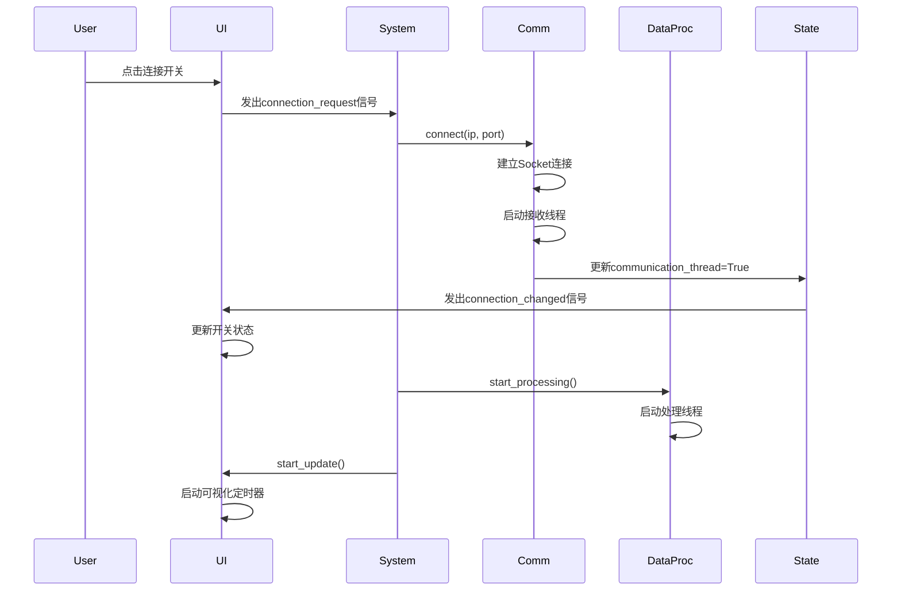

# 无人机检测系统 - 系统架构设计文档

## 1. 系统概述

无人机检测系统是一个基于频谱分析的实时无人机检测平台，通过接收射频信号的FFT数据，进行实时处理、可视化和目标检测。系统采用经典的三层架构设计，实现了数据采集、处理和展示的完整流程。

### 1.1 设计目标

- **实时性**：支持高频率的FFT数据流处理（10ms/帧）
- **可扩展性**：模块化设计，便于添加新的算法和功能
- **稳定性**：完善的错误处理和状态管理机制
- **用户友好**：现代化的UI界面，直观的数据可视化

### 1.2 技术栈

| 层次 | 技术 | 说明 |
|------|------|------|
| 通信层 | Python Socket | TCP通信，接收下位机FFT数据 |
| 数据处理层 | NumPy, Threading | 多线程FFT数据处理 |
| 可视化层 | PyQt6, QFluentWidgets | 现代化UI框架 |
| 图表渲染 | QtCharts, Matplotlib | 频谱图和瀑布图渲染 |

---

## 2. 系统架构

### 2.1 整体架构图

```
┌─────────────────────────────────────────────────────────────┐
│                     DroneDetectionSystem                     │
│                      (系统主控制器)                          │
└────────────┬────────────────────────────────┬────────────────┘
             │                                │
             ▼                                ▼
    ┌────────────────┐                ┌──────────────┐
    │     State      │◄───────────────┤  Main Window │
    │  (状态管理器)   │                │  (主界面)     │
    └────────┬───────┘                └──────┬───────┘
             │                                │
             │ 状态共享                       │ UI更新
             │                                │
    ┌────────┴──────────┬────────────────────┴────────┐
    │                   │                              │
    ▼                   ▼                              ▼
┌───────────────┐  ┌──────────────┐         ┌─────────────────┐
│ Communication │  │DataProcessor │         │  UI Interfaces  │
│   (通信层)     │  │ (数据处理层) │         │   (界面层)       │
└───────┬───────┘  └──────┬───────┘         └─────────────────┘
        │                  │
        │ FFT Queue        │
        └──────────────────┘
```

### 2.2 三层架构设计

#### 2.2.1 通信层（Communication Layer）

**职责**：
- 管理与下位机的TCP连接
- 接收和解析FFT数据包
- 实现包同步和丢包检测机制
- 将完整的FFT帧放入队列

**核心机制**：
- **魔数同步**：每个数据包前添加魔数（0xAABBCCDD）用于包边界识别
- **帧重组**：通过packet_id识别帧边界，将多个包重组为完整帧
- **丢包检测**：检测packet_id的连续性，发现丢包并记录日志

**数据流向**：
```
下位机 → Socket → 魔数同步 → 包解析 → 帧重组 → FFT Queue
```

#### 2.2.2 数据处理层（Data Processing Layer）

**职责**：
- 从队列获取原始FFT数据
- 执行数据处理（dB转换、滤波等）
- 维护频谱数据更新和瀑布图数据缓冲更新
- 提供线程安全的数据访问接口

**核心功能**：
1. **频谱处理**：
   - 幅度转dB：`20 * log10(magnitude)`
   - 移动平均滤波（可选）
   
2. **瀑布图管理**：
   - 维护固定大小的deque缓冲区（默认64行）
   - 对频谱进行降采样（1024 → 512点）
   - 实时更新瀑布图numpy数组
   - 新数据在顶部，旧数据向下滚动

3. **线程安全**：
   - 使用`threading.Lock`保护共享数据
   - 所有get方法返回数据副本

**数据流向**：
```
FFT Queue → 处理线程 → dB转换 → 滤波 → 降采样 → 瀑布图缓冲 → numpy数组
```

#### 2.2.3 用户界面层（UI Layer）

**职责**：
- 实时可视化频谱数据和瀑布图
- 参数配置界面
- 系统状态监控
- 用户交互处理

**界面组成**：
- **Home Interface**：主界面，包含实时频谱图、瀑布图和配置面板
- **Config Interface**：详细参数配置
- **Visualization Interface**：专用可视化分析界面

---

## 3. 核心模块详解

### 3.1 状态管理（State）

State类是系统的核心状态管理器，继承自QObject支持信号机制。

**属性**：
```python
_communication_thread: bool     # 通信线程运行状态
data_processing_thread: bool    # 数据处理线程运行状态
data_queue_status: str          # 队列状态（idle/processing）
device_ip: str                  # 设备IP地址
device_port: int                # 设备端口
fft_length: int                 # FFT长度
center_freq: float              # 中心频率（MHz）
sample_rate: float              # 采样率（MHz）
```

**信号**：
```python
connection_changed = pyqtSignal(bool)  # 连接状态变化信号
```

**设计特点**：
- 使用`@property`装饰器实现只读属性
- 状态变更时自动发出信号
- 所有模块共享同一个State实例

### 3.2 数据队列机制

系统使用Python的`queue.Queue`实现生产者-消费者模式：

```python
fft_data_queue = queue.Queue(maxsize=5)
```

**队列数据格式**：
```python
{
    "timestamp": float,      # 时间戳
    "data": np.ndarray,     # FFT数据数组（float32）
    "length": int,          # 数据长度
    "frame_id": int         # 帧ID
}
```

**流控机制**：
- 队列满时，丢弃最旧数据
- 防止内存溢出
- 保证实时性

---

## 4. 数据流动逻辑

### 4.1 启动流程



### 4.2 数据处理流程

```
┌──────────┐
│ 下位机   │ 发送FFT包（1024点/帧，分8个包）
└────┬─────┘
     │
     ▼
┌──────────────────────────────┐
│  Communication Layer         │
│  1. 搜索魔数（0xAABBCCDD）   │
│  2. 读取包头（packet_id等）  │
│  3. 接收数据                 │
│  4. 帧重组                   │
│  5. 放入Queue                │
└────┬─────────────────────────┘
     │
     ▼
┌──────────────────────────────┐
│  Data Processing Layer       │
│  1. 从Queue取数据            │
│  2. dB转换                   │
│  3. 可选滤波                 │
│  4. 降采样                   │
│  5. 更新瀑布图缓冲           │
│  6. 更新瀑布图数组           │
└────┬─────────────────────────┘
     │
     ▼
┌──────────────────────────────┐
│  UI Layer                    │
│  1. 定时器触发（40fps）      │
│  2. 获取最新频谱             │
│  3. 获取瀑布图数组           │
│  4. 渲染到界面               │
└──────────────────────────────┘
┌─────────────────────────────────────────────────────────┐
│                   数据处理层                              │
│  维护: full_rgb_waterfall (1024×1024×3)                 │
│  - 实时更新瀑布图buffer                                   │
│  - 转换为RGB图像                                         │
│  - 提供给检测层读取                                       │
└────────────────┬────────────────────────────────────────┘
                 │
                 │ 检测层定期读取
                 ▼
┌─────────────────────────────────────────────────────────┐
│                   检测算法层                              │
│  维护: latest_result_image (1024×1024×3)                │
│  - 从数据处理层获取最新RGB图                              │
│  - YOLO检测                                              │
│  - 在原图上绘制检测框                                     │
│  - 更新latest_result_image                              │
└────────────────┬────────────────────────────────────────┘
                 │
                 │ UI定期读取
                 ▼
┌─────────────────────────────────────────────────────────┐
│                      UI层                                │
│  - 从检测层获取latest_result_image                        │
│  - 降采样到显示尺寸 (512×128×3)                          │
│  - 显示在界面上                                          │
│  (可能多帧读到同一张图，但保证同步！)                      │
└─────────────────────────────────────────────────────────┘
```

### 4.3 控件信号流动逻辑

#### 4.3.1 连接请求流程

```
用户点击开关
    ↓
ConfigInterface.on_switch_toggled()
    ↓
发出 connection_request(bool) 信号
    ↓
DroneDetectionSystem.handle_connection_request()
    ↓
调用 connect_device() 或 disconnect_device()
    ↓
Communication.connect() 修改 State.communication_thread
    ↓
State 发出 connection_changed(bool) 信号
    ↓
ConfigInterface.on_connection_state_changed()
    ↓
更新UI开关状态
```

#### 4.3.2 状态更新机制

- **单向数据流**：UI → 业务层 → State → UI
- **避免循环触发**：UI更新时使用`blockSignals(True)`
- **自动重试**：连接失败时自动将开关状态恢复

---

## 5. 通信协议设计

### 5.1 数据包格式

每个数据包结构：

```
+-------------+------------+-------------+------------------+
|   Magic     | Packet ID  | Data Length |      Data        |
| (4 bytes)   | (4 bytes)  |  (4 bytes)  |  (variable)      |
+-------------+------------+-------------+------------------+
| 0xAABBCCDD  |    0-7     |    512      |  128 * float32   |
+-------------+------------+-------------+------------------+
```

**字段说明**：
- **Magic**：固定魔数，用于包同步
- **Packet ID**：包序号（0-7），用于帧重组和丢包检测
- **Data Length**：数据部分字节数
- **Data**：实际FFT数据（128个float32）

### 5.2 帧结构

一帧完整FFT数据：
- **总点数**：1024点
- **分包数量**：8个包（每包128点）
- **总字节数**：4096字节（1024 × 4）
- **传输时间**：约8ms（每包间隔1ms）

### 5.3 同步机制

#### 5.3.1 包同步

通过`_sync_to_magic()`方法实现：
```python
1. 逐字节读取数据
2. 维护4字节滑动窗口
3. 匹配魔数（0xAABBCCDD）
4. 找到后读取包头和数据
```

#### 5.3.2 帧同步

通过packet_id判断：
- `packet_id == 0`：新帧开始
- 处理上一帧数据
- 重置缓冲区

#### 5.3.3 丢包处理

- 检测packet_id连续性
- 发现丢包记录日志
- 帧不完整时丢弃整帧
- 下一帧自动重新同步

---

## 6. UI界面组件

### 6.1 主窗口（FluentWindow）

采用QFluentWidgets框架的FluentWindow作为主窗口：
- **导航栏**：左侧垂直导航，支持折叠
- **多页面管理**：通过导航项切换不同界面
- **启动画面**：SplashScreen启动加载效果

### 6.2 Home界面布局

```
┌────────────────────────────────────────────────────┐
│                  Home Interface                    │
├────────────────────────┬───────────────────────────┤
│  Visualization Card    │   Config Interface        │
│  (左侧 3:1)            │   (右侧 1:1)              │
│                        │                           │
│  ┌──────────────────┐ │  ┌─────────────────────┐  │
│  │ Spectrum Chart   │ │  │  System Status      │  │
│  │  (功率谱图)       │ │  │  └─ Connection      │  │
│  └──────────────────┘ │  │                     │  │
│                        │  │  Receiver           │  │
│  ┌──────────────────┐ │  │  └─ FFT             │  │
│  │ Waterfall Plot   │ │  │     └─ Length       │  │
│  │  (瀑布图)         │ │  │     └─ Decimation   │  │
│  └──────────────────┘ │  │     └─ Frequency    │  │
│                        │  └─────────────────────┘  │
│  ┌──────────────────┐ │                           │
│  │ Statistics Info  │ │                           │
│  └──────────────────┘ │                           │
└────────────────────────┴───────────────────────────┘
```

### 6.3 配置界面（ConfigInterface）

使用TreeWidget实现分层参数配置：

```
System Status
└─ Connection (SwitchButton)

Receiver
└─ FFT
   ├─ Length (ComboBox + Set)
   ├─ Decimation Factor (ComboBox + Set)
   └─ Centre Frequency (LineEdit + Set)
```

**控件特点**：
- **当前值标签**：淡蓝色背景显示当前值
- **输入控件**：ComboBox或LineEdit
- **Set按钮**：应用新配置
- **实时保存**：更新parameters.json

### 6.4 可视化组件

#### 6.4.1 频谱图（Spectrum Chart）

使用QtCharts的QLineSeries：
- **X轴**：频率（MHz）
- **Y轴**：功率（dB）
- **动态范围**：自动调整Y轴范围
- **降采样**：1024点 → 500点显示

#### 6.4.2 瀑布图（Waterfall Plot）

使用QLabel + QPixmap显示：
- **数据来源**：从DataProcessor获取numpy数组
- **颜色映射**：使用matplotlib的jet色图
- **归一化**：-80dB ~ -20dB映射到0-255
- **显示方向**：顶部为最新数据，底部为历史数据

---

## 7. 线程模型

### 7.1 线程架构

系统采用多线程模型：

```
主线程（UI Thread）
├─ 负责UI渲染和事件处理
├─ QTimer定时触发可视化更新（40fps）
└─ 从数据处理层获取数据副本

通信线程（Communication Thread）
├─ Socket数据接收（阻塞IO）
├─ 包同步和帧重组
└─ 将完整帧放入Queue

数据处理线程（Processing Thread）
├─ 从Queue获取FFT数据
├─ 执行数据处理
└─ 更新共享数据结构
```

### 7.2 线程同步

**锁机制**：
```python
self.data_lock = threading.Lock()

# 写操作
with self.data_lock:
    self.latest_spectrum = processed_spectrum
    
# 读操作
with self.data_lock:
    return self.latest_spectrum.copy()
```

**无锁共享**：
- State对象：通过PyQt信号机制（线程安全）
- Queue对象：内置线程安全

### 7.3 性能优化

1. **降采样**：减少数据传输量
2. **帧跳跃**：UI显示帧率 < 数据接收帧率
3. **数据副本**：避免线程间数据竞争
4. **定时器优化**：使用QTimer而非轮询

---

## 8. 错误处理机制

### 8.1 连接异常处理

```python
try:
    self.communication.connect(ip, port)
except Exception as e:
    logger.error(f"连接失败: {e}")
    self.state.communication_thread = False
    # 自动更新UI状态
```

### 8.2 数据处理异常

```python
try:
    fft_frame = self.fft_data_queue.get(timeout=1)
    # 处理数据
except queue.Empty:
    # 正常超时，继续循环
    continue
except Exception as e:
    logger.error(f"数据处理异常: {e}", exc_info=True)
```

### 8.3 丢包处理

- 检测到丢包时记录日志
- 帧不完整时丢弃整帧
- 通过魔数自动重新同步
- 不影响后续数据接收

---

## 9. 扩展性设计

### 9.1 算法层接口预留

数据处理层提供的接口可供算法模块使用：

```python
# 获取实时频谱
spectrum = data_processor.get_latest_spectrum()

# 获取瀑布图（用于目标检测）
waterfall = data_processor.get_waterfall_array()

# 获取统计信息
stats = data_processor.get_stats()
```

### 9.2 参数配置系统

通过JSON文件实现配置持久化：
- `parameters.json`：存储所有模块参数
- 支持动态加载和保存
- UI配置实时生效

### 9.3 模块化设计

各模块职责单一，耦合度低：
- 通信层：只负责数据接收
- 处理层：只负责数据处理
- UI层：只负责显示
- 便于独立测试和替换

---

## 10. 性能指标

### 10.1 实时性能

| 指标 | 数值 | 说明 |
|------|------|------|
| 数据接收频率 | 100 fps | 10ms/帧 |
| UI更新频率 | 40 fps | 25ms/帧 |
| 处理延迟 | < 5ms | 单帧处理时间 |
| 队列大小 | 5帧 | 最多缓冲50ms数据 |

### 10.2 资源占用

- **CPU使用率**：10-20%（单核）
- **内存占用**：约100MB
- **网络带宽**：约400KB/s

---

## 11. 未来优化方向

### 11.1 性能优化

1. **GPU加速**：使用CUDA进行FFT处理
2. **C++扩展**：关键路径使用C++重写
3. **零拷贝**：减少数据复制次数

### 11.2 功能扩展

1. **算法层**：目标检测、跟踪、识别
2. **数据记录**：原始数据和结果保存
3. **回放功能**：历史数据回放分析
4. **远程监控**：Web界面和移动端

### 11.3 稳定性增强

1. **自动重连**：连接断开自动重试
2. **看门狗**：线程异常自动恢复
3. **健康检查**：定期检测系统状态

---

## 12. 总结

本系统采用**经典三层架构**设计，通过**队列解耦**、**信号驱动**和**线程隔离**实现了高性能的实时数据处理和可视化。

**核心优势**：
- ✅ 清晰的模块划分和职责分离
- ✅ 完善的错误处理和状态管理
- ✅ 现代化的UI设计和良好的用户体验
- ✅ 良好的扩展性，便于后续功能添加

**设计原则**：
- **单一职责**：每个模块只做一件事
- **依赖注入**：通过参数传递依赖
- **接口隔离**：最小化模块间接口
- **开闭原则**：对扩展开放，对修改关闭
